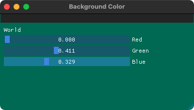

# Learn-ImGui

# 0: Demo


# 1: Hello world


# 2: Basic RGB


# 3: Basic Docking


This is the same window as before, except that now, "Hello World" window is docked directly onto our OpenGL Window.<br>
This example deserves it's own folder as, at the time of writing this, I couldn't find how to create a simple docking mechanism anywhere on the browsable internet.

To achieve this, add the following lines inside the OpenGL's loop:
```C++
// #################### DOCKING
const ImGuiViewport* viewport = ImGui::GetMainViewport();
ImGui::SetNextWindowPos(viewport->WorkPos);
ImGui::SetNextWindowSize(viewport->WorkSize);
ImGui::PushStyleVar(ImGuiStyleVar_WindowRounding, 0.0f);
ImGui::PushStyleVar(ImGuiStyleVar_WindowBorderSize, 0.0f);
ImGui::PopStyleVar(2);
// #################### End of DOCKING
```
Note: From the picture, it should be pretty obvious that the background color is now red.<br>
However, since ImGui is now docked and sits on top of the OpenGL window, it's original color is only seen through the mercy of ImGui's window transparency.

# 4: Window Flags

`ImGui::Begin` allows a few window flags passed on to the .<br>
```C++
ImGuiWindowFlags window_flags = 0;
				 window_flags |= ImGuiWindowFlags_NoTitleBar;
				 window_flags |= ImGuiWindowFlags_NoScrollbar;
				 window_flags |= ImGuiWindowFlags_MenuBar;
				 window_flags |= ImGuiWindowFlags_NoMove;
				 window_flags |= ImGuiWindowFlags_NoResize;
				 window_flags |= ImGuiWindowFlags_NoCollapse;
				 window_flags |= ImGuiWindowFlags_NoNav;
				 window_flags |= ImGuiWindowFlags_NoBackground;
				 window_flags |= ImGuiWindowFlags_NoBringToFrontOnFocus;
				 window_flags |= ImGuiWindowFlags_UnsavedDocument;
```
These arguments can be passed to `ImGui::Begin`'s third parameter as follows:
```C++
ImGui::Begin("Title", nullptr, window_flags);
```
The second argument allows for a window's close button to be either enabled/disabled; a `nullptr` will let the second parameter to be ignored.<br>
I disabled a few parameters; the window looks a little interesting than the previous ones.
